Injury Prediction
================
Trevor Okinda
2024

- [Student Details](#student-details)
- [Setup Chunk](#setup-chunk)
  - [Source:](#source)
  - [Reference:](#reference)
- [Understanding the Dataset (Exploratory Data Analysis
  (EDA))](#understanding-the-dataset-exploratory-data-analysis-eda)
  - [Loading the Dataset](#loading-the-dataset)
  - [Measures of Frequency](#measures-of-frequency)
  - [Measures of Central Tendency](#measures-of-central-tendency)
  - [Measures of Distribution](#measures-of-distribution)
  - [Measures of Relationship](#measures-of-relationship)
  - [ANOVA](#anova)
  - [Plots](#plots)
- [Preprocessing and Data
  Transformation](#preprocessing-and-data-transformation)
  - [Missing Values](#missing-values)
- [Training Model](#training-model)
  - [Data Splitting](#data-splitting)
  - [Bootstrapping](#bootstrapping)
  - [Cross-validation](#cross-validation)
  - [Training Different Models](#training-different-models)
  - [Performance Comparison with
    resamples](#performance-comparison-with-resamples)
  - [Saving Model](#saving-model)

# Student Details

|                       |                   |
|-----------------------|-------------------|
| **Student ID Number** | 134780            |
| **Student Name**      | Trevor Okinda     |
| **BBIT 4.2 Group**    | C                 |
| **Project Name**      | Injury Prediction |

# Setup Chunk

**Note:** the following KnitR options have been set as the global
defaults: <BR>
`knitr::opts_chunk$set(echo = TRUE, warning = FALSE, eval = TRUE, collapse = FALSE, tidy = TRUE)`.

More KnitR options are documented here
<https://bookdown.org/yihui/rmarkdown-cookbook/chunk-options.html> and
here <https://yihui.org/knitr/options/>.

### Source:

The dataset that was used can be downloaded here: *\<<a
href="https://www.kaggle.com/datasets/mrsimple07/injury-prediction-dataset\"
class="uri">https://www.kaggle.com/datasets/mrsimple07/injury-prediction-dataset\</a>\>*

### Reference:

*\<mrsimple07. (n.d.). Injury Prediction Dataset \[Data set\]. Kaggle.
<a
href="https://www.kaggle.com/datasets/mrsimple07/injury-prediction-dataset\"
class="uri">https://www.kaggle.com/datasets/mrsimple07/injury-prediction-dataset\</a>\>  
Refer to the APA 7th edition manual for rules on how to cite datasets:
<https://apastyle.apa.org/style-grammar-guidelines/references/examples/data-set-references>*

# Understanding the Dataset (Exploratory Data Analysis (EDA))

## Loading the Dataset

``` r
# Load the dataset
InjuryData <- read.csv("injury_data.csv", colClasses = c(
  Player_Age = "numeric",
  Player_Weight = "numeric",
  Player_Height = "numeric",
  Previous_Injuries = "factor",
  Training_Intensity = "numeric",
  Recovery_Time = "numeric",
  Likelihood_of_Injury = "factor"  # Assuming this is the target variable (categorical)
))
```

## Measures of Frequency

``` r
# Measures of Frequency
# Frequency of categorical variable
freq_table <- table(InjuryData$Likelihood_of_Injury)
print("Frequency Table:")
```

    ## [1] "Frequency Table:"

``` r
print(freq_table)
```

    ## 
    ##   0   1 
    ## 500 500

``` r
# Proportions of categories
prop_table <- prop.table(freq_table)
print("Proportions Table:")
```

    ## [1] "Proportions Table:"

``` r
print(prop_table)
```

    ## 
    ##   0   1 
    ## 0.5 0.5

``` r
# Summary of numeric variables (count of non-missing values)
print("Summary of Player_Age and Training_Intensity:")
```

    ## [1] "Summary of Player_Age and Training_Intensity:"

``` r
summary(InjuryData$Player_Age)
```

    ##    Min. 1st Qu.  Median    Mean 3rd Qu.    Max. 
    ##   18.00   22.00   28.00   28.23   34.00   39.00

``` r
summary(InjuryData$Training_Intensity)
```

    ##      Min.   1st Qu.    Median      Mean   3rd Qu.      Max. 
    ## 0.0000307 0.2410415 0.4839116 0.4905380 0.7304045 0.9977494

## Measures of Central Tendency

``` r
# Measures of Central Tendency
# Mean
mean_age <- mean(InjuryData$Player_Age, na.rm = TRUE)
mean_weight <- mean(InjuryData$Player_Weight, na.rm = TRUE)
print("Mean of Player_Age and Player_Weight:")
```

    ## [1] "Mean of Player_Age and Player_Weight:"

``` r
print(mean_age)
```

    ## [1] 28.231

``` r
print(mean_weight)
```

    ## [1] 74.79435

``` r
# Median
median_age <- median(InjuryData$Player_Age, na.rm = TRUE)
median_weight <- median(InjuryData$Player_Weight, na.rm = TRUE)
print("Median of Player_Age and Player_Weight:")
```

    ## [1] "Median of Player_Age and Player_Weight:"

``` r
print(median_age)
```

    ## [1] 28

``` r
print(median_weight)
```

    ## [1] 75.02057

``` r
# Mode (custom function, as R does not have a built-in mode function)
get_mode <- function(x) {
  uniq_x <- unique(x)
  uniq_x[which.max(tabulate(match(x, uniq_x)))]
}
mode_injuries <- get_mode(InjuryData$Previous_Injuries)
print("Mode of Previous_Injuries:")
```

    ## [1] "Mode of Previous_Injuries:"

``` r
print(mode_injuries)
```

    ## [1] 1
    ## Levels: 0 1

## Measures of Distribution

``` r
# Measures of Distribution
# Range
range_age <- range(InjuryData$Player_Age, na.rm = TRUE)
range_weight <- range(InjuryData$Player_Weight, na.rm = TRUE)
print("Range of Player_Age and Player_Weight:")
```

    ## [1] "Range of Player_Age and Player_Weight:"

``` r
print(range_age)
```

    ## [1] 18 39

``` r
print(range_weight)
```

    ## [1]  40.19191 104.65010

``` r
# Variance
var_age <- var(InjuryData$Player_Age, na.rm = TRUE)
var_weight <- var(InjuryData$Player_Weight, na.rm = TRUE)
print("Variance of Player_Age and Player_Weight:")
```

    ## [1] "Variance of Player_Age and Player_Weight:"

``` r
print(var_age)
```

    ## [1] 42.75039

``` r
print(var_weight)
```

    ## [1] 97.86395

``` r
# Standard Deviation
sd_age <- sd(InjuryData$Player_Age, na.rm = TRUE)
sd_weight <- sd(InjuryData$Player_Weight, na.rm = TRUE)
print("Standard Deviation of Player_Age and Player_Weight:")
```

    ## [1] "Standard Deviation of Player_Age and Player_Weight:"

``` r
print(sd_age)
```

    ## [1] 6.538378

``` r
print(sd_weight)
```

    ## [1] 9.892621

``` r
# Skewness and Kurtosis (requires 'e1071' package)
library(e1071)

skew_age <- skewness(InjuryData$Player_Age, na.rm = TRUE)
kurt_age <- kurtosis(InjuryData$Player_Age, na.rm = TRUE)
print("Skewness and Kurtosis of Player_Age:")
```

    ## [1] "Skewness and Kurtosis of Player_Age:"

``` r
print(skew_age)
```

    ## [1] 0.03472504

``` r
print(kurt_age)
```

    ## [1] -1.277328

## Measures of Relationship

``` r
# Measures of Relationship
# Correlation between two numeric variables
cor_age_weight <- cor(InjuryData$Player_Age, InjuryData$Player_Weight, use = "complete.obs")
print("Correlation between Player_Age and Player_Weight:")
```

    ## [1] "Correlation between Player_Age and Player_Weight:"

``` r
print(cor_age_weight)
```

    ## [1] -0.04028833

``` r
# Covariance between two numeric variables
cov_age_weight <- cov(InjuryData$Player_Age, InjuryData$Player_Weight, use = "complete.obs")
print("Covariance between Player_Age and Player_Weight:")
```

    ## [1] "Covariance between Player_Age and Player_Weight:"

``` r
print(cov_age_weight)
```

    ## [1] -2.605917

``` r
# Scatterplot to visualize relationship
plot(InjuryData$Player_Age, InjuryData$Player_Weight, 
     xlab = "Player Age", ylab = "Player Weight", main = "Age vs Weight")
```

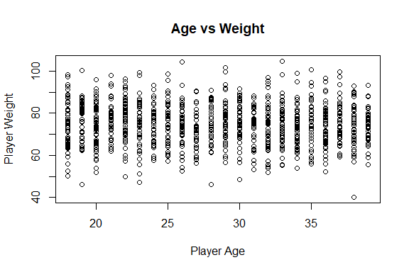<!-- -->

## ANOVA

``` r
# Perform ANOVA: Testing if Player_Age differs by Likelihood_of_Injury
anova_age <- aov(Player_Age ~ Likelihood_of_Injury, data = InjuryData)

# Print summary of ANOVA for Player_Age
print("ANOVA for Player_Age by Likelihood_of_Injury:")
```

    ## [1] "ANOVA for Player_Age by Likelihood_of_Injury:"

``` r
summary(anova_age)
```

    ##                       Df Sum Sq Mean Sq F value Pr(>F)
    ## Likelihood_of_Injury   1      0    0.00       0  0.996
    ## Residuals            998  42708   42.79

``` r
# Perform ANOVA: Testing if Player_Weight differs by Likelihood_of_Injury
anova_weight <- aov(Player_Weight ~ Likelihood_of_Injury, data = InjuryData)

# Print summary of ANOVA for Player_Weight
print("ANOVA for Player_Weight by Likelihood_of_Injury:")
```

    ## [1] "ANOVA for Player_Weight by Likelihood_of_Injury:"

``` r
summary(anova_weight)
```

    ##                       Df Sum Sq Mean Sq F value Pr(>F)
    ## Likelihood_of_Injury   1      0    0.33   0.003  0.954
    ## Residuals            998  97766   97.96

## Plots

``` r
# Boxplot for Player_Age by Likelihood_of_Injury
boxplot(Player_Age ~ Likelihood_of_Injury, data = InjuryData,
        main = "Boxplot of Player_Age by Likelihood_of_Injury",
        xlab = "Likelihood of Injury", ylab = "Player Age")
```

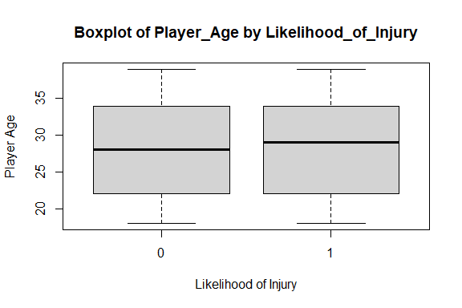<!-- -->

``` r
# Boxplot for Player_Weight by Likelihood_of_Injury
boxplot(Player_Weight ~ Likelihood_of_Injury, data = InjuryData,
        main = "Boxplot of Player_Weight by Likelihood_of_Injury",
        xlab = "Likelihood of Injury", ylab = "Player Weight")
```

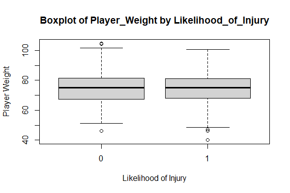<!-- -->

``` r
# Univariate Plots
# Histogram for Player_Age
hist(InjuryData$Player_Age, 
     main = "Histogram of Player_Age", 
     xlab = "Player Age", 
     col = "lightblue", 
     border = "black", 
     breaks = 10)
```

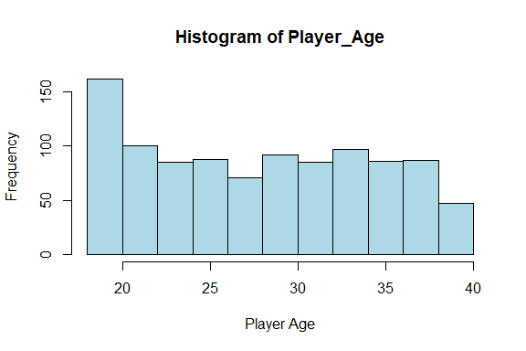<!-- -->

``` r
# Histogram for Player_Weight
hist(InjuryData$Player_Weight, 
     main = "Histogram of Player_Weight", 
     xlab = "Player Weight", 
     col = "lightgreen", 
     border = "black", 
     breaks = 10)
```

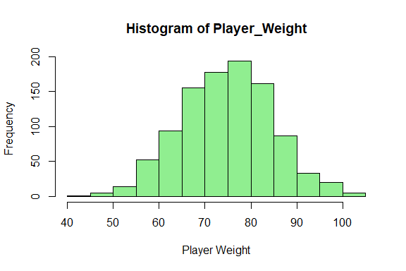<!-- -->

``` r
# Boxplot for Player_Age
boxplot(InjuryData$Player_Age, 
        main = "Boxplot of Player_Age", 
        ylab = "Player Age", 
        col = "lightblue", 
        border = "black")
```

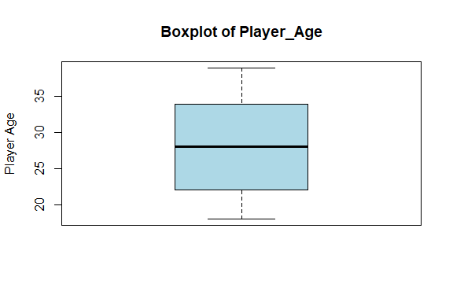<!-- -->

``` r
# Boxplot for Player_Weight
boxplot(InjuryData$Player_Weight, 
        main = "Boxplot of Player_Weight", 
        ylab = "Player Weight", 
        col = "lightgreen", 
        border = "black")
```

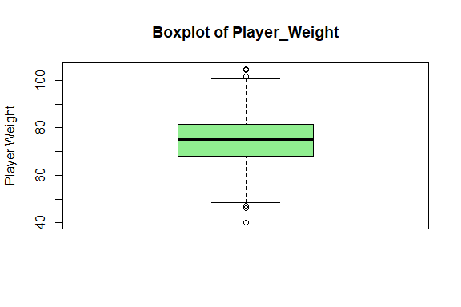<!-- -->

``` r
# Boxplot for Player_Age by Likelihood_of_Injury
boxplot(Player_Age ~ Likelihood_of_Injury, 
        data = InjuryData, 
        main = "Boxplot of Player_Age by Likelihood_of_Injury", 
        xlab = "Likelihood of Injury", 
        ylab = "Player Age", 
        col = c("lightblue", "lightgreen"))
```

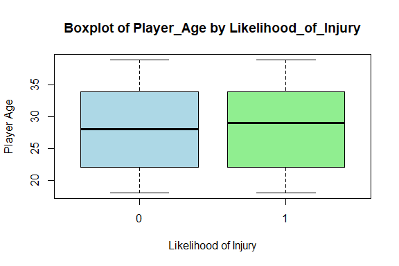<!-- -->

``` r
# Multivariate Plots
# Scatterplot between Player_Age and Player_Weight
plot(InjuryData$Player_Age, InjuryData$Player_Weight, 
     main = "Scatterplot of Player_Age vs Player_Weight", 
     xlab = "Player Age", 
     ylab = "Player Weight", 
     col = "blue", 
     pch = 16)
```

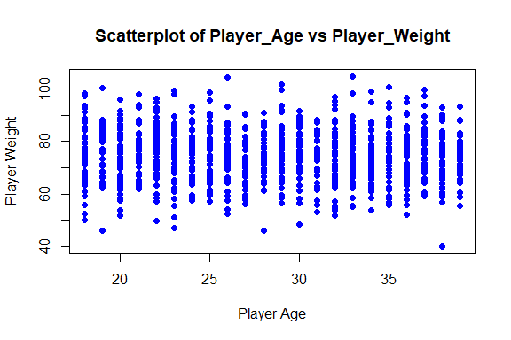<!-- -->

``` r
# Pairwise scatterplot matrix for numerical variables
pairs(InjuryData[, c("Player_Age", "Player_Weight", "Training_Intensity", "Recovery_Time")],
      main = "Pairs Plot of Numerical Variables")

# Facet grid plot for numerical variables by Likelihood_of_Injury using 'ggplot2'
library(ggplot2)
```

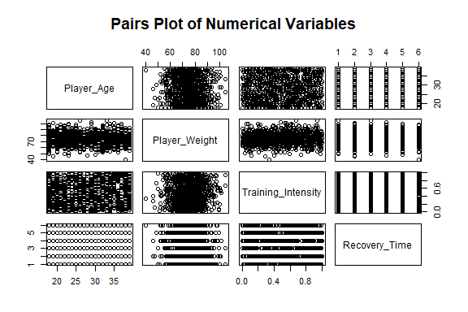<!-- -->

``` r
# Scatter plot of Player_Age vs Player_Weight, faceted by Likelihood_of_Injury
ggplot(InjuryData, aes(x = Player_Age, y = Player_Weight, color = Likelihood_of_Injury)) +
  geom_point() +
  facet_wrap(~Likelihood_of_Injury) +
  labs(title = "Player_Age vs Player_Weight by Likelihood_of_Injury",
       x = "Player Age", y = "Player Weight") +
  theme_minimal()
```

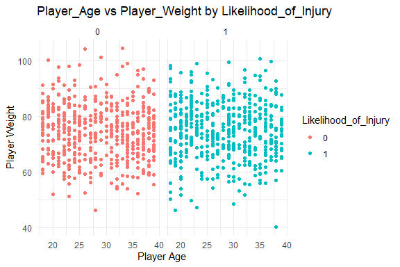<!-- -->

``` r
# Boxplot of Player_Age by Likelihood_of_Injury using 'ggplot2'
ggplot(InjuryData, aes(x = Likelihood_of_Injury, y = Player_Age, fill = Likelihood_of_Injury)) +
  geom_boxplot() +
  labs(title = "Boxplot of Player_Age by Likelihood_of_Injury",
       x = "Likelihood of Injury", y = "Player Age") +
  theme_minimal()
```

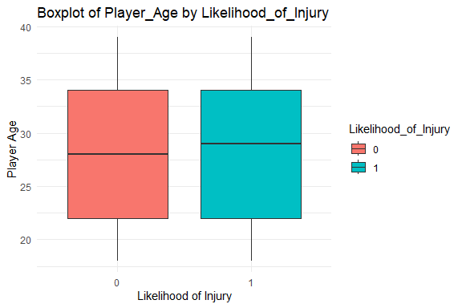<!-- -->

# Preprocessing and Data Transformation

## Missing Values

``` r
# Check if there are any missing values in the dataset
# This will return TRUE for any column that has missing values
missing_values <- sapply(InjuryData, function(x) sum(is.na(x)))

# Display the number of missing values per column
print("Missing values per column:")
```

    ## [1] "Missing values per column:"

``` r
print(missing_values)
```

    ##           Player_Age        Player_Weight        Player_Height 
    ##                    0                    0                    0 
    ##    Previous_Injuries   Training_Intensity        Recovery_Time 
    ##                    0                    0                    0 
    ## Likelihood_of_Injury 
    ##                    0

``` r
# Check if there are any missing values in the entire dataset
total_missing <- sum(is.na(InjuryData))
cat("Total missing values in the dataset:", total_missing, "\n")
```

    ## Total missing values in the dataset: 0

``` r
# Check if any column has missing values
any_missing <- any(missing_values > 0)
cat("Does the dataset have missing values?", ifelse(any_missing, "Yes", "No"), "\n")
```

    ## Does the dataset have missing values? No

``` r
# Visualize missing data (optional, using the 'VIM' package)
library(VIM)
```

    ## Loading required package: colorspace

    ## Loading required package: grid

    ## The legacy packages maptools, rgdal, and rgeos, underpinning the sp package,
    ## which was just loaded, will retire in October 2023.
    ## Please refer to R-spatial evolution reports for details, especially
    ## https://r-spatial.org/r/2023/05/15/evolution4.html.
    ## It may be desirable to make the sf package available;
    ## package maintainers should consider adding sf to Suggests:.
    ## The sp package is now running under evolution status 2
    ##      (status 2 uses the sf package in place of rgdal)

    ## VIM is ready to use.

    ## Suggestions and bug-reports can be submitted at: https://github.com/statistikat/VIM/issues

    ## 
    ## Attaching package: 'VIM'

    ## The following object is masked from 'package:datasets':
    ## 
    ##     sleep

``` r
aggr(InjuryData, col = c("navyblue", "yellow"), numbers = TRUE, sortVars = TRUE, labels = names(InjuryData), cex.axis = 0.7, gap = 3, ylab = c("Missing data", "Pattern"))
```

<!-- -->

    ## 
    ##  Variables sorted by number of missings: 
    ##              Variable Count
    ##            Player_Age     0
    ##         Player_Weight     0
    ##         Player_Height     0
    ##     Previous_Injuries     0
    ##    Training_Intensity     0
    ##         Recovery_Time     0
    ##  Likelihood_of_Injury     0

# Training Model

## Data Splitting

``` r
library(caret)
```

    ## Loading required package: lattice

``` r
# Set seed for reproducibility
set.seed(123)

# 1. Data Splitting (80% Training, 20% Testing)
train_index <- sample(1:nrow(InjuryData), 0.8 * nrow(InjuryData))
train_data <- InjuryData[train_index, ]
test_data <- InjuryData[-train_index, ]
cat("Training set size:", nrow(train_data), "\n")
```

    ## Training set size: 800

``` r
cat("Test set size:", nrow(test_data), "\n")
```

    ## Test set size: 200

## Bootstrapping

``` r
# 2. Bootstrapping (Sampling with replacement)
n_bootstrap <- 1000
bootstrap_samples <- matrix(NA, nrow = n_bootstrap, ncol = nrow(InjuryData))
for(i in 1:n_bootstrap) {
  bootstrap_samples[i, ] <- sample(1:nrow(InjuryData), nrow(InjuryData), replace = TRUE)
}
head(bootstrap_samples)
```

    ##      [,1] [,2] [,3] [,4] [,5] [,6] [,7] [,8] [,9] [,10] [,11] [,12] [,13] [,14]
    ## [1,]  939  893  766  112    5  469  479  612  411   407   899   655   746   615
    ## [2,]   32  102  616  124  450  641  402   71  859   583   548   837   587   383
    ## [3,]  528  894  140  117  630   96  822  643  903   490   259   821   916   531
    ## [4,]  210  666  401  956  670  673  678  162  938   634   818   609   370   472
    ## [5,]  792  457  809    1  320  505  674  754  445   605   346   166   946   483
    ## [6,]  615  129  220  382  714  240  552  637  230    10   256   555    32   463
    ##      [,15] [,16] [,17] [,18] [,19] [,20] [,21] [,22] [,23] [,24] [,25] [,26]
    ## [1,]    58   391   290   287   466   530   995   488   814   265   591   913
    ## [2,]   283   991   554   587   412   545   891   618   544   249   855   597
    ## [3,]   317   132   282   392   628   945   826   911   729   713    13   117
    ## [4,]   760   502   162   469   938   843   414   904   477   738   444   695
    ## [5,]   145   866   258   934   870    96   782   763   897   250   697   447
    ## [6,]   444   950   498    77   938   275   927   706   829   995   343    54
    ##      [,27] [,28] [,29] [,30] [,31] [,32] [,33] [,34] [,35] [,36] [,37] [,38]
    ## [1,]   647   478   904   321     9   867   281   642   907   708    40   148
    ## [2,]   300   999   190   933   608    40   591   736   199   782   362   952
    ## [3,]   491   701   750   229    31   555   631   895   517    24   598   225
    ## [4,]   885   334   132   761    26   946   108   676   125   337    10   435
    ## [5,]   445   612   954   788   845   815   683    39   441   375   732   315
    ## [6,]   181   273   457   644   992   997   188   594   413   142   332   402
    ##      [,39] [,40] [,41] [,42] [,43] [,44] [,45] [,46] [,47] [,48] [,49] [,50]
    ## [1,]   651    18   950   398   963   348    67   878   732   605   383   551
    ## [2,]   816   601   259   886   791   587   317   635   351   318   707   904
    ## [3,]   758   866   932   187   934   325   603   317    19   780    33   458
    ## [4,]   634   253   314    65   910   709   333   591   948   988   230   956
    ## [5,]   442   278   812   382   697   932   739    81   326   674   573   255
    ## [6,]   306   257   631    47   617   551   817    63   639   775   953   563
    ##      [,51] [,52] [,53] [,54] [,55] [,56] [,57] [,58] [,59] [,60] [,61] [,62]
    ## [1,]   151   591   471   344   168   161   421   444    29   633   241   966
    ## [2,]   767   188   987   347    49   857   796   924   374   717   975   812
    ## [3,]    31   804   458   143   284   740   730   648   342   814   123   700
    ## [4,]   852   873   660   199   885   288   684    21   184   416   818   364
    ## [5,]   166   431    78   136    35   439   680   584   134   154   180   939
    ## [6,]   560   289   818   909    82   379   499   838   613   631   631   149
    ##      [,63] [,64] [,65] [,66] [,67] [,68] [,69] [,70] [,71] [,72] [,73] [,74]
    ## [1,]   665    42   922   984    44   224     8   912   551   352   999   833
    ## [2,]   745   947   307   543   230   845   937   587   697   558   307   572
    ## [3,]    72   810   838   708   811   592   103   703   424   223   485   474
    ## [4,]   423    36   299   990   546   355    99   517   805   815     4   738
    ## [5,]   502     4    11   377   148   664   343   122     4   753   644   468
    ## [6,]   850   725   124    60   392   923    46   485   185   590    59   314
    ##      [,75] [,76] [,77] [,78] [,79] [,80] [,81] [,82] [,83] [,84] [,85] [,86]
    ## [1,]   862   826   217   696   683   451    56   278   401   468   611   654
    ## [2,]   830   885   823   114   790   920   757    12   883   556   474   916
    ## [3,]   942   750   276   519   713   724   949   108    11   561   514   253
    ## [4,]    18   166   291   374   221   599   458   978   618   834   567   226
    ## [5,]   832   867   897   527   336   482   338   756   523   569   673   141
    ## [6,]   367   660   988   889    90   985   974   530   742   243   300   790
    ##      [,87] [,88] [,89] [,90] [,91] [,92] [,93] [,94] [,95] [,96] [,97] [,98]
    ## [1,]   229   375   576   242   280   734   520   660   888    74    86   434
    ## [2,]   868   829   220   503   891   464   177   172   322   165   275    77
    ## [3,]   872    29   215   677   341    30   436   134   703   311   992   931
    ## [4,]   609   200    86   594   505   612   518   694   169   639   589   759
    ## [5,]   513   191   116   576   250   291    20   844   336   993   343   898
    ## [6,]   385   461   999   319   483   577   974   942   402   496    65   260
    ##      [,99] [,100] [,101] [,102] [,103] [,104] [,105] [,106] [,107] [,108]
    ## [1,]    17    649    163    485    469    447    185    656    820    474
    ## [2,]   103     94     56    389    967    144    620    979    102    568
    ## [3,]   244     27    462    553    828     32    316     84    854      4
    ## [4,]   398    217    760    333    999    740    265    726    617    930
    ## [5,]   580    438    453     83    448    319    291     34   1000    340
    ## [6,]   267    826    781    384    511     34    991    968    688    543
    ##      [,109] [,110] [,111] [,112] [,113] [,114] [,115] [,116] [,117] [,118]
    ## [1,]    355     35    950    538    781     36    687    503    409     28
    ## [2,]     26    492    173    294    522    424    522     38    731    819
    ## [3,]    615    179    606    424    422    162     18    598    359    291
    ## [4,]    588    809    137     82    415    905    104    250    729    124
    ## [5,]    666    682    959    313    375      5    947    997    534    516
    ## [6,]    980    901    172    319    582    869    708    592    277     55
    ##      [,119] [,120] [,121] [,122] [,123] [,124] [,125] [,126] [,127] [,128]
    ## [1,]    669    973    812    310    981    153    285    148     93    269
    ## [2,]    925    990    215    497    822    853    322    727    448    915
    ## [3,]    798    515    237    840    841    288    479    542    153    556
    ## [4,]    490    482    994    442    165    362    706    276    614    831
    ## [5,]    864    399    643    495    743    591    217    600    246    738
    ## [6,]    574    752    567    381    154    442    986    930    271    142
    ##      [,129] [,130] [,131] [,132] [,133] [,134] [,135] [,136] [,137] [,138]
    ## [1,]    717    675    951    372    517     56     77    471    348    684
    ## [2,]    659    884    845     33    806    576    165    199    538    977
    ## [3,]    275    834    556    615    981     18    330    307    882    624
    ## [4,]    356    212    746    980    808    117    242    272    191    258
    ## [5,]    171     40    244    546    306    470    659     46    682      3
    ## [6,]    972    464    508    442     29    210     77    528    764    367
    ##      [,139] [,140] [,141] [,142] [,143] [,144] [,145] [,146] [,147] [,148]
    ## [1,]    584    126    422    152    720     75    599    606    480    987
    ## [2,]    175    741    805     32    123    557    808    755    865     36
    ## [3,]     47    303    387    454    688    183    630    940    287    687
    ## [4,]    940    528    788    238     65    401    370    777    934    928
    ## [5,]    642    550    928    693    331    127    716    384    402    542
    ## [6,]    469    688    961    678    654    950    442    414    608     63
    ##      [,149] [,150] [,151] [,152] [,153] [,154] [,155] [,156] [,157] [,158]
    ## [1,]    304    783    833    694    778     86     42    100    937     25
    ## [2,]    184    562     68    552    284    440    341    822    567    633
    ## [3,]    436     97    701    532    838    435   1000    952     86    372
    ## [4,]    744    232    601    202     90    432    510    800     19    488
    ## [5,]    903    781    461    587    845    725    266    144    237    693
    ## [6,]    408    364    967    130    901    753    561     92    178    723
    ##      [,159] [,160] [,161] [,162] [,163] [,164] [,165] [,166] [,167] [,168]
    ## [1,]    606    180    293    896    539    713    211    547    930    703
    ## [2,]    983    164    978    814    412    351     12     11    216     30
    ## [3,]    556    172    570    930    582     74    874    903    107     17
    ## [4,]    896    715     79    903    348    387    956    338    819    637
    ## [5,]    385     57      7    163     94     80     74    337     65    740
    ## [6,]    630    270    546    682    666    265     30    219    400    385
    ##      [,169] [,170] [,171] [,172] [,173] [,174] [,175] [,176] [,177] [,178]
    ## [1,]    343     76    207    433    291    669    839    989    941    366
    ## [2,]    395    766    216    785    919    482     74    310    900    582
    ## [3,]    296    693    165    207    977    143    429    817    337    149
    ## [4,]    658    537     18    993    371    639    478    644    906    275
    ## [5,]     60    572    665    954    438    130    930    805    325    627
    ## [6,]    316     77    960    743    193    396     63    465     24    807
    ##      [,179] [,180] [,181] [,182] [,183] [,184] [,185] [,186] [,187] [,188]
    ## [1,]     34    381    201    815    641    266    681    425     39    242
    ## [2,]    714    723    614    251    681     92    636    888    560    237
    ## [3,]    670    164    382    950     66    524    283     67    787    930
    ## [4,]    934    512    149    164    200    628    583     33    752    162
    ## [5,]    758    750     71     34    702    750    292    364   1000    560
    ## [6,]    632    612    435    835    887    792    570    423    455    520
    ##      [,189] [,190] [,191] [,192] [,193] [,194] [,195] [,196] [,197] [,198]
    ## [1,]    876    504    215    902    928    103    957    592    858    400
    ## [2,]    841    767    263    179    408    850    856    328    704    828
    ## [3,]    536    164    411    846     40    177     85    190    150    994
    ## [4,]   1000    269     99    112    621     32    268    997    772    729
    ## [5,]    188    915    609    733    532    342     15    267    306    945
    ## [6,]     18    315    511    629     70    730    863    577    653    262
    ##      [,199] [,200] [,201] [,202] [,203] [,204] [,205] [,206] [,207] [,208]
    ## [1,]      2    674     78    158    156    981    215    698    286    729
    ## [2,]     16    380    559    466    925    573    497    830    665    720
    ## [3,]    629    727    664    549    867    101    548    557    443    768
    ## [4,]    240    987    307    332    254    368    897    372    345    849
    ## [5,]     67    637    536    446    836    801    397    177    885    624
    ## [6,]    266    749    676    309    548    924    700    980    667    536
    ##      [,209] [,210] [,211] [,212] [,213] [,214] [,215] [,216] [,217] [,218]
    ## [1,]    423    326    964    707    430    699    115    750    560    650
    ## [2,]    325    791     67     70    504    473    403    523    747    908
    ## [3,]    630    432    845    644    191    528    234    376    702    407
    ## [4,]     16    230    485    770    839    320    543     59    686    955
    ## [5,]    309    888    607    187     70    376    903    679    444    831
    ## [6,]     90    641    517    849    185    571     98    390     20    869
    ##      [,219] [,220] [,221] [,222] [,223] [,224] [,225] [,226] [,227] [,228]
    ## [1,]    540    716    754    835    385     44    433    161    164    115
    ## [2,]    737    702    328    583    591    997    611      7    256     13
    ## [3,]    288    791    249    502    453    757    755    588    481    634
    ## [4,]    761    399    144    222    295    636    612    288    708    586
    ## [5,]    316    310    511    149     89    340    750    943    261     95
    ## [6,]     81    338    184    627     13    569    733    494    676    535
    ##      [,229] [,230] [,231] [,232] [,233] [,234] [,235] [,236] [,237] [,238]
    ## [1,]    909    882    335     77    174    606    631    658    876    434
    ## [2,]    852    713    245    396    462    761    871    732     73    736
    ## [3,]    950    851    570    871    763    232    528    428    266    315
    ## [4,]     10    833    505    942    733    612    296    331    774    817
    ## [5,]    560    417     10    271    248    733     51    373    382    533
    ## [6,]    450    730    107    268     70    193    485    925    238     40
    ##      [,239] [,240] [,241] [,242] [,243] [,244] [,245] [,246] [,247] [,248]
    ## [1,]    615    282    420    804     56    825    515    217    523     51
    ## [2,]    761    247    420    211     34    189    696    369    332    910
    ## [3,]    392    319    148    530    500     38    231    896    287    290
    ## [4,]    140    311    541    769    195    966    760    732      2    712
    ## [5,]    516    559    629    351    914    315    777    480     53    609
    ## [6,]    406    241    689    101    676   1000    655    421    382    676
    ##      [,249] [,250] [,251] [,252] [,253] [,254] [,255] [,256] [,257] [,258]
    ## [1,]    926    784    879     11    230    352    223    613    962    918
    ## [2,]    842    487    528    610    586    243    194    149    136    289
    ## [3,]    117    945    443    475     76    333     28    690    668    382
    ## [4,]    735    994    692    817    832    486    676    248    583     90
    ## [5,]    929    347      8    469    881     35     28    338    920    608
    ## [6,]    403    957    494    897    691    793    911    439     50    374
    ##      [,259] [,260] [,261] [,262] [,263] [,264] [,265] [,266] [,267] [,268]
    ## [1,]    145    645    627    335    243    608    318    419    603    918
    ## [2,]    865    207    856    914    376    995    528    772    167     98
    ## [3,]    684      7    746    231    605    586    840    460    558     32
    ## [4,]    191    701    506    690    885    242    212    272    408    897
    ## [5,]    627    950    165    900    736    104     16     30    900    906
    ## [6,]    464    942    434    977    105    349     79    795    651    663
    ##      [,269] [,270] [,271] [,272] [,273] [,274] [,275] [,276] [,277] [,278]
    ## [1,]    447    601    143    635    291    542    162    581    965    967
    ## [2,]    958    860    420    497    211    663    456    147    327    716
    ## [3,]     85     95    698    147    231    344    585    648    610    730
    ## [4,]    390    200    707    838    123    656     34    270     59    710
    ## [5,]    237    281    757    240    531    437    359    985    792    230
    ## [6,]    185    381    830    336     55    310    715    525     20    659
    ##      [,279] [,280] [,281] [,282] [,283] [,284] [,285] [,286] [,287] [,288]
    ## [1,]    130    208    488    535    471    728    789    978    275    905
    ## [2,]    450    914    313    688    890     23    369    651    386    558
    ## [3,]    989     41    554    880    295    791    667    260    290    922
    ## [4,]    791    981    129    726    580    923    555    862    542    706
    ## [5,]    569     19    483    384    936    818     14    178    938    751
    ## [6,]    923    216    616    253    910    289    353    764    681    273
    ##      [,289] [,290] [,291] [,292] [,293] [,294] [,295] [,296] [,297] [,298]
    ## [1,]    723    958    211    197    685    720    487    872    544     48
    ## [2,]     89     89    785    278    205    342    793    439    457    828
    ## [3,]    559    192    321    711    657    127    223    427    420    228
    ## [4,]    916     20    320      1    544    842    492    870    697    846
    ## [5,]    652    979    460    815    633    812    390    236    642    363
    ## [6,]    957    650     88    815    678    686    409    567    124    971
    ##      [,299] [,300] [,301] [,302] [,303] [,304] [,305] [,306] [,307] [,308]
    ## [1,]    783    666    916     35    567    415    893    152    529    327
    ## [2,]    419    728    122    102    426    460    783    745    143    548
    ## [3,]    166    852     60     17    704    361    750    488    494     59
    ## [4,]    321    242    423    651    423    285    942    219    754    957
    ## [5,]     83    110    460    891    946    402    763    438     29    881
    ## [6,]    680    658    336    223    896    649    134    592    504    119
    ##      [,309] [,310] [,311] [,312] [,313] [,314] [,315] [,316] [,317] [,318]
    ## [1,]    441    845    419    186    950    781    974    836    639    537
    ## [2,]     25    937      5    974    593    386     51    869    256    600
    ## [3,]    154    593    753     32    218    327    325    625    669    344
    ## [4,]     69    214    954    174    812    552    160    583    214    356
    ## [5,]    856    341    745    211    995    768    593    987    504    651
    ## [6,]    297    568    932    172    139      2    892    677    797    156
    ##      [,319] [,320] [,321] [,322] [,323] [,324] [,325] [,326] [,327] [,328]
    ## [1,]     29    693    528    681    240      9    293    310    726    750
    ## [2,]     75    417    647    271    730    997    343    779    560    281
    ## [3,]    896    277    560    341    421    395    753    186    480    727
    ## [4,]    353    930      1    741    779    168     48    909    529    878
    ## [5,]     32    616    591     79    471    584    666    113    697    231
    ## [6,]    265    895    199    412     50    713     13    321    802    563
    ##      [,329] [,330] [,331] [,332] [,333] [,334] [,335] [,336] [,337] [,338]
    ## [1,]    748    470    536    782    158    621    702    628    367    808
    ## [2,]    138    482    796    646    524    147    236    931    264     55
    ## [3,]    523     87    484    150     92    498    785    335    546     97
    ## [4,]    139    448    241    570    714    818    142    780    224    256
    ## [5,]    438    786    422    754    660    754    342    174    462    864
    ## [6,]     58    768    391    638    125    754    452    970    809    451
    ##      [,339] [,340] [,341] [,342] [,343] [,344] [,345] [,346] [,347] [,348]
    ## [1,]    223    887    679    229     72    239    782    432    321    151
    ## [2,]    860    621    816    386    766    845    749    181    358    851
    ## [3,]    841    291      4    246    118    553    377    331    467    297
    ## [4,]    969    132    249    881    315    636     43     27    228    745
    ## [5,]    390    195      2    904    671    876    507    820     25    374
    ## [6,]    568    871    537    438     18    222    519    686    454    563
    ##      [,349] [,350] [,351] [,352] [,353] [,354] [,355] [,356] [,357] [,358]
    ## [1,]     26     46    535    223    703    917    337    256     39    327
    ## [2,]     31    715    108    203    669    545    667    153    840    512
    ## [3,]    938    272    620    525    408    854    380    461    943    759
    ## [4,]    818    241    844    265    400    638    796    860    380     77
    ## [5,]    861    796    251    434     93    641    799    601    616    574
    ## [6,]    686    272      2    694    923    511    428    689    301    837
    ##      [,359] [,360] [,361] [,362] [,363] [,364] [,365] [,366] [,367] [,368]
    ## [1,]     45    303    332     96    686    467    828     83    857    401
    ## [2,]    993    860    568    296     63    507    876     72    464    266
    ## [3,]    772    712    894    906    383     37    786     78    102    761
    ## [4,]    967    374    515    471    524    344    788    912     33    939
    ## [5,]    518    767    568     20    348    501    562    714    949      5
    ## [6,]    327    603    560    857    724     42     78    257    584    870
    ##      [,369] [,370] [,371] [,372] [,373] [,374] [,375] [,376] [,377] [,378]
    ## [1,]    649    621    382    878    919    159    678    289    848    828
    ## [2,]    527    810    664    616    348     40    898    878    658     75
    ## [3,]    150    861    915    767    120    211    434    806    168    135
    ## [4,]    705    761    692    229    912    803    783    729    808    765
    ## [5,]    589    265    686    605    736    878    759    994    588    636
    ## [6,]    105    193      8    576     83    366    362     76    549    714
    ##      [,379] [,380] [,381] [,382] [,383] [,384] [,385] [,386] [,387] [,388]
    ## [1,]    584    645    831    202    937    348    549    430     83    993
    ## [2,]    642    640    956    147    752    706    633    297    727    773
    ## [3,]    351    748    548    780    625    138    744    700    650    975
    ## [4,]    529    790    229    926    681    362    525    569    613    257
    ## [5,]    955     94    330    105    522    842    318    729    254    202
    ## [6,]    654    224    689    844    945    800    101    714    874    311
    ##      [,389] [,390] [,391] [,392] [,393] [,394] [,395] [,396] [,397] [,398]
    ## [1,]    144      6    764    180    712     89    462     95    814    857
    ## [2,]    122    262    626    209    283    140    975    610    910    130
    ## [3,]    330    605    331    242    884    940    317    637     54    194
    ## [4,]    692    716    244    287    749    960    990    418     42    638
    ## [5,]    346    967    401    863    317     49    361    895     32    637
    ## [6,]    201    884    811    542    559    723     36    352    305    599
    ##      [,399] [,400] [,401] [,402] [,403] [,404] [,405] [,406] [,407] [,408]
    ## [1,]    264    171    887    756    792      5    142    993    449    869
    ## [2,]    336    655    573    458    379    629    152    987    899    802
    ## [3,]    161    277    147    975    557    134    195    602    491    377
    ## [4,]    261    643    901    109    845    719    262    193     74    183
    ## [5,]    983    550    675    256    900    167    132    740    919    173
    ## [6,]    968    201    823    211    699    711    821     21    916    532
    ##      [,409] [,410] [,411] [,412] [,413] [,414] [,415] [,416] [,417] [,418]
    ## [1,]    355      4     35    238    210    778    524    640    432    771
    ## [2,]    811    168    571     30    144    905    825     64    687    717
    ## [3,]    676     74    323    260    294     79    246    423    450    472
    ## [4,]    882    665     43    532    466    143    474    551    387    856
    ## [5,]    127    225    967    978    168    571    686    549    897    227
    ## [6,]    294    250    306    712    108    894    650     38    350    149
    ##      [,419] [,420] [,421] [,422] [,423] [,424] [,425] [,426] [,427] [,428]
    ## [1,]    282    204    956    229     45    264    913    901    339    358
    ## [2,]    951    859    722    623    300    117    969    253    227    493
    ## [3,]    756    369     13    831     95    408    326    834    670    140
    ## [4,]    829    275    421    303    211    822    263    220     16      5
    ## [5,]    327    385    733    222    507    967    616    432    845    386
    ## [6,]    668    347    998    749    853      8    785     90    296    859
    ##      [,429] [,430] [,431] [,432] [,433] [,434] [,435] [,436] [,437] [,438]
    ## [1,]     32    258    145    887    817    712    819    914    922    798
    ## [2,]    826    969    254    432    965     40    220    318    210    902
    ## [3,]    858    250    809    640    233    187    812    883    386    102
    ## [4,]    152    880    696    115    682    545    116    804     27    191
    ## [5,]    342    589    570    761    720    109     39    605    833    359
    ## [6,]    876    460    696    124    912    208    414    951    609    375
    ##      [,439] [,440] [,441] [,442] [,443] [,444] [,445] [,446] [,447] [,448]
    ## [1,]    211     69    349    477    558    524    312      1    944    862
    ## [2,]    104    491    491    790    252    346    678    804    527    689
    ## [3,]    188    683    937    115    110    696    844    321    923    418
    ## [4,]    276    393     69    903    693     33     52      2    875    513
    ## [5,]    270    183    316    225    738    333    624    557    451    923
    ## [6,]    814    880    170    701    943    536    891      7    227    580
    ##      [,449] [,450] [,451] [,452] [,453] [,454] [,455] [,456] [,457] [,458]
    ## [1,]    638    498     52    519    197    394    292    768    392    255
    ## [2,]    155     72    313     86    363    498    985    142    748    584
    ## [3,]    690    551    156    325    943    413    694     21    709    524
    ## [4,]    109    415    682    882    772    548    762    704    674    400
    ## [5,]    664    509     17    403    665    276     52    632    803    334
    ## [6,]     47    781    398    479    147    750     65    159    518    433
    ##      [,459] [,460] [,461] [,462] [,463] [,464] [,465] [,466] [,467] [,468]
    ## [1,]     49    479     69    679    918    332    394    702    221    990
    ## [2,]    259    576    170     19    159    684    494    121    621    966
    ## [3,]     36    861    964    232    409    129    666    308    960    976
    ## [4,]     60    656    424    765    374    867    980    626    427    145
    ## [5,]    651    644    444    981    338    954    244    375     46    621
    ## [6,]    792     35    291    447      1    448     18    457    334    847
    ##      [,469] [,470] [,471] [,472] [,473] [,474] [,475] [,476] [,477] [,478]
    ## [1,]    380    705    303    142     71    703    674    458    373    719
    ## [2,]    154    669    295    917    697    763    373      4    522    720
    ## [3,]     79    398    458    348    688    270     61    461      8    859
    ## [4,]    272    930    264    197    780    699    607    239    407    450
    ## [5,]    918     36    889    231    504     67    478    872    896    631
    ## [6,]    496     77    729    607    337    158    425    809    360    360
    ##      [,479] [,480] [,481] [,482] [,483] [,484] [,485] [,486] [,487] [,488]
    ## [1,]    765    403    978    622    768    918    786    435    894    835
    ## [2,]    951    720     35    115    883    935    542    789    475    550
    ## [3,]    786    248     15    311    930    725     25    890    186    715
    ## [4,]    527    933    297    975    359    873    984    329    459    714
    ## [5,]    599    354    448    465    907    583     28    181    881    896
    ## [6,]    112    991    851    300     18    288    306    946    502    185
    ##      [,489] [,490] [,491] [,492] [,493] [,494] [,495] [,496] [,497] [,498]
    ## [1,]    363    564    703    165    366     18    681    321    807    783
    ## [2,]    125    765    751    386     46    548    950    266    805    684
    ## [3,]      1     54    205    552    328    786    423    728    685    335
    ## [4,]    817    234    111    807    156    401    492    933    675     82
    ## [5,]    162    693    454    822    588    269    652    781    321    124
    ## [6,]    652     11    833    808    698     82     35    913     64    423
    ##      [,499] [,500] [,501] [,502] [,503] [,504] [,505] [,506] [,507] [,508]
    ## [1,]    689    966    865    870    424    458    828    930    346    530
    ## [2,]    708    867    647    523    630    239    898    873    781    928
    ## [3,]    872     90    592    536    624    172    864    336    683    197
    ## [4,]    206    701    967     45    671    387    290     25    203    889
    ## [5,]    552    424    612    345    992    969    580    481    175    688
    ## [6,]    847    981    410     45    277    231    969    885    370    281
    ##      [,509] [,510] [,511] [,512] [,513] [,514] [,515] [,516] [,517] [,518]
    ## [1,]    453    956     35    198    989     54    683    764     73    278
    ## [2,]    907    855    296    424    379      6    517    925    489    489
    ## [3,]    132    666    697    590    968    470    975    670    939     56
    ## [4,]    976    697    756    635    890    739    420    391    778    532
    ## [5,]    307    880    883    301    662    453    575    318    523    234
    ## [6,]    984    890    875    670    383    464    666    449     26    747
    ##      [,519] [,520] [,521] [,522] [,523] [,524] [,525] [,526] [,527] [,528]
    ## [1,]     20    175    990    114    999    681    398    541    779    956
    ## [2,]    357    176    188    705    266    642    355    365    959    743
    ## [3,]    607    180    842     83     96    133    641     76    658    646
    ## [4,]    574    913    213    235    462    643    180    846    992    113
    ## [5,]    601    503    795    720    886    874    428     90     47    634
    ## [6,]    708    556    807    542    998    500    324    449    582    831
    ##      [,529] [,530] [,531] [,532] [,533] [,534] [,535] [,536] [,537] [,538]
    ## [1,]     20    465    236    984    179    857    269     76    902    835
    ## [2,]    461    886    220    399    710     61    783    482    945    419
    ## [3,]    832    719    863    690    984    682    929    378    350    541
    ## [4,]    357     30    291    206    529    779    513    841     59    475
    ## [5,]    972    765    819    547    215    568    100     61    295    447
    ## [6,]    277    831    897    824    856    933     97     77    740    871
    ##      [,539] [,540] [,541] [,542] [,543] [,544] [,545] [,546] [,547] [,548]
    ## [1,]     92    428    492    267     19     11     63    356    406    907
    ## [2,]    697    818    586    716    136    136    617    132    116    783
    ## [3,]    958    518    232    827    405    281    105    480    370    271
    ## [4,]    451    436    428    406    556    432    937    862    585     15
    ## [5,]    965    273    481    420    465    146    381    276    201    831
    ## [6,]    244    526    808    986    206    970    232    964    339    898
    ##      [,549] [,550] [,551] [,552] [,553] [,554] [,555] [,556] [,557] [,558]
    ## [1,]    155    258    999    252    390    743    228    823    506     48
    ## [2,]    849    731    674    155    455    475    525    392    537    960
    ## [3,]     72    790    726    933    828     50    520    372    468     36
    ## [4,]    942    547    392    816    961    602    875      1    239    231
    ## [5,]    514    876     90    515     69    150    188    955    928    858
    ## [6,]    567    649    769    561    844    624    659    809    505    776
    ##      [,559] [,560] [,561] [,562] [,563] [,564] [,565] [,566] [,567] [,568]
    ## [1,]    382    767    668    797    196    681    389    624     95    251
    ## [2,]    693    896    181    118    282    465    396    813    400    138
    ## [3,]    169     75    312    671     80    778    228    673    139    834
    ## [4,]    285    318    662    151    799    267    606    805    991    990
    ## [5,]    129    454    393    110    149    622    881    598    488    850
    ## [6,]    336     16    575    816     23    852    741    932    234    861
    ##      [,569] [,570] [,571] [,572] [,573] [,574] [,575] [,576] [,577] [,578]
    ## [1,]    619    880    137    339    156    783    572    715    221     17
    ## [2,]    773    431    262    661     81    282    357    875    351    752
    ## [3,]    904    118    791    877    754     42    797    639    479    180
    ## [4,]    152    496    794    113     90    936      3    660    616    597
    ## [5,]     25    523    980    628    828    219      9    762    805     10
    ## [6,]    815     67    518     84    288    651    522    697    838    812
    ##      [,579] [,580] [,581] [,582] [,583] [,584] [,585] [,586] [,587] [,588]
    ## [1,]    445    553    537    239    332    510    787     52    711    267
    ## [2,]    844    989    811    280    712    577    983    931    318     74
    ## [3,]    640    725    435    260    173    783    931    251    178    544
    ## [4,]    142    144    603    720    355    910     90    849    191    415
    ## [5,]    436    932     82    355    596    715    885    744    539    227
    ## [6,]    380    531    814    767    416    974    398    571    979    153
    ##      [,589] [,590] [,591] [,592] [,593] [,594] [,595] [,596] [,597] [,598]
    ## [1,]    655    201    506    344    339    651    545    969    617    791
    ## [2,]    156     52    151    271    167    733    823    598    889    912
    ## [3,]    964    722    492     17    747    202    507    596    831    912
    ## [4,]     17    493    468    578    272    782    677    736    638     41
    ## [5,]    337    802    403     87    547    819    669    604    383    311
    ## [6,]    655    180    816    693    297    491    952    440     89    549
    ##      [,599] [,600] [,601] [,602] [,603] [,604] [,605] [,606] [,607] [,608]
    ## [1,]    248     17    650    456    530    920    102    857    946     71
    ## [2,]    863    716    788    585    668    771    883    301    829   1000
    ## [3,]    287    612    622     70    837     34    340    512    973    662
    ## [4,]     24    127    541    277    859    754    766     93    731    156
    ## [5,]    682    180    696    333    625     82    404    943    666     98
    ## [6,]    508    903    981    274    154    803    354    186     57    999
    ##      [,609] [,610] [,611] [,612] [,613] [,614] [,615] [,616] [,617] [,618]
    ## [1,]    359    396    489     80    643    927    227    533    750    830
    ## [2,]    441    572    753    251    964    714    970    773    971    524
    ## [3,]    395    386    357    413    643    121    837    388     62    915
    ## [4,]    138     93    948    658     98    767    766    132    169     47
    ## [5,]     99    166    262    859    114    457    613    526    512    274
    ## [6,]    919    520    651    842    255    874    388    693    231    513
    ##      [,619] [,620] [,621] [,622] [,623] [,624] [,625] [,626] [,627] [,628]
    ## [1,]    674     28    420    154    641     90    277    938    376    981
    ## [2,]    133    856     62    580    636    354    608    193    595    907
    ## [3,]    379    111    325     18    984    142    969    734    888    733
    ## [4,]    706    836    652    797    178    715    634    487    731     30
    ## [5,]    885    498    387    469    196     95    785    704    144    300
    ## [6,]    411     32    661    443    463     58     13    861     31    517
    ##      [,629] [,630] [,631] [,632] [,633] [,634] [,635] [,636] [,637] [,638]
    ## [1,]    870    633    675    606     12    993    761    492    141    818
    ## [2,]    551     29    475    472      5    962    425    538    284    815
    ## [3,]    696    907    479    189    163    171    626    638    948    550
    ## [4,]    836     10     87    428    368    834     32    690    684    262
    ## [5,]    406    415     83    256    171    896    113    384    299    465
    ## [6,]    527     64    217    257    221     37    451    256    269    371
    ##      [,639] [,640] [,641] [,642] [,643] [,644] [,645] [,646] [,647] [,648]
    ## [1,]    960    545    152      9    671    352    706    384    287     60
    ## [2,]    582    218    220    838    887    251      4    192    534    847
    ## [3,]    193    838     26    252    772    338    171    884    765    107
    ## [4,]    618    721    488    408    896    423    718    715    858    984
    ## [5,]    123    246    607    291    106    108    153    590    655    370
    ## [6,]    432    875    608    494    152    133    337    379    151    195
    ##      [,649] [,650] [,651] [,652] [,653] [,654] [,655] [,656] [,657] [,658]
    ## [1,]    603    611    374    737    407    882    933    202    683    659
    ## [2,]    774    891     57    579    725    381    586    613    217    102
    ## [3,]    766    470    302    414    582    964     12    368    181    763
    ## [4,]    810    467    766    303    107    974    138    431    370    929
    ## [5,]    791    930    970    640    970    440    850    299    364    261
    ## [6,]    784    800    361    603    351    247    396    937    758     63
    ##      [,659] [,660] [,661] [,662] [,663] [,664] [,665] [,666] [,667] [,668]
    ## [1,]    912    751    167    608    752    306    504    915    132    179
    ## [2,]     92    833    163    808      2    686    275    858    289     87
    ## [3,]     29    245    554    458    564    903    327   1000    615    727
    ## [4,]    535    415    662    884    727    669    670    977    569    969
    ## [5,]    933    713    413    387    555    794    476    757    846    369
    ## [6,]    579    181    652    905     53    145    486    489     59    536
    ##      [,669] [,670] [,671] [,672] [,673] [,674] [,675] [,676] [,677] [,678]
    ## [1,]    163    290    925    589    484    468    310    230    323    857
    ## [2,]    899    677    192    728    829    827    320    224    781    585
    ## [3,]    624    872    931    902    425    799    642    635    429    888
    ## [4,]    743    388    583    898    666    212    636    400    813    820
    ## [5,]    652     14    789    458    789    325    600    594    842    886
    ## [6,]    794    129    779    599    885    468    771    199    854     38
    ##      [,679] [,680] [,681] [,682] [,683] [,684] [,685] [,686] [,687] [,688]
    ## [1,]    213    309    424    645    261    467    492    862    583    366
    ## [2,]    768    785    974    497    369    863    253    949    520    677
    ## [3,]    242    286    639    255    257    879    765    520    574    939
    ## [4,]    251    369    992    551    802    310    717    935    760    804
    ## [5,]    520    288    375    969    837    701    552    858    368    193
    ## [6,]    239    133    404    632    146    876    670     30    569    240
    ##      [,689] [,690] [,691] [,692] [,693] [,694] [,695] [,696] [,697] [,698]
    ## [1,]    145    477    256     98    529    189    267    270    360    161
    ## [2,]    780    340    773    504    569    818    744    179    675    133
    ## [3,]    173    506    746    980    813    617    613    227    489    116
    ## [4,]    894    675     49    813    472    580    704    859    464    840
    ## [5,]    818    556    170    144    224    447    833     77    915    723
    ## [6,]    507    128    151    863    818    871    810    230    173    880
    ##      [,699] [,700] [,701] [,702] [,703] [,704] [,705] [,706] [,707] [,708]
    ## [1,]    674    960    138    738    893    550    205    780    291    104
    ## [2,]    456    108     37    695    666    828    473    367    184    470
    ## [3,]     65    137     31      6    362    582    187    459    480    900
    ## [4,]     67    209    917    375    414    301    330    293    699    610
    ## [5,]    307    412    730    214    610    173    268    301    236    410
    ## [6,]     61    888    550    777     57    373    166    583    542    496
    ##      [,709] [,710] [,711] [,712] [,713] [,714] [,715] [,716] [,717] [,718]
    ## [1,]    187     33    238    939    118    779    840    593    772    588
    ## [2,]    543    374    820    905    777    693    785    361    362    920
    ## [3,]    254    523    396     89    603    400    789    251    799    146
    ## [4,]    714      4    344    660    939    898     46    100     97    238
    ## [5,]    424    301    345    413    466    911    515    119    328    741
    ## [6,]    192    648    175    377    917    322    669    379    128    920
    ##      [,719] [,720] [,721] [,722] [,723] [,724] [,725] [,726] [,727] [,728]
    ## [1,]    303    696     14    563    667    587    433    413    422    236
    ## [2,]    357    319    957    459    608    976    750    155    284    633
    ## [3,]    418    658    840    669    293    959    169    611    742    494
    ## [4,]    270    471    646    949    215    946    703    759    834     36
    ## [5,]    620    885    825    376    644    438    775    232     59    810
    ## [6,]    348    475    926    345    882    619    504    504    394     37
    ##      [,729] [,730] [,731] [,732] [,733] [,734] [,735] [,736] [,737] [,738]
    ## [1,]    275    277     49    262    325    753    216    254    144    457
    ## [2,]    223    782    141    815    782    231    223    202    349    988
    ## [3,]    613    546    703    859    489    260    350    373    716    257
    ## [4,]    160    337    751    987    213    791    464    364     61    392
    ## [5,]    608    707    779    630    457      3    434    636    326     81
    ## [6,]     74    945    375    884    535    284    604    549    124    598
    ##      [,739] [,740] [,741] [,742] [,743] [,744] [,745] [,746] [,747] [,748]
    ## [1,]    875    741    846    639    702     69    120     30    830    941
    ## [2,]    521    717    590    816     69    602    205    846    456    583
    ## [3,]    865    218    672    652    843    477    730    908    988    640
    ## [4,]    834    495    496    764    977    291    898    363    161    394
    ## [5,]    815    767    112    706    331     49    624    509    227    935
    ## [6,]    471    321    499    388    690    945    968    253    804    759
    ##      [,749] [,750] [,751] [,752] [,753] [,754] [,755] [,756] [,757] [,758]
    ## [1,]    628    580    580     96    604    469    692     70    810    276
    ## [2,]    995    827    832    557    825    558    589    638    953    629
    ## [3,]    735    523    255    527    250    412    894    318    699    407
    ## [4,]    723    926     58    987    353    879     63    914    132    958
    ## [5,]    175     98    546    738    699    284    184    137    366    185
    ## [6,]    405    490    752    219    104    942    848    863    790    345
    ##      [,759] [,760] [,761] [,762] [,763] [,764] [,765] [,766] [,767] [,768]
    ## [1,]    763    465     75    296    405    741    736     58     83    299
    ## [2,]    941    494    978    404    992    116    171    968    879    904
    ## [3,]    453    923    439    597     20    210    419    627    470    753
    ## [4,]    151    258    810    928     96    257    224     61    193    104
    ## [5,]    229    326    644    335    307     95    650     83    894    328
    ## [6,]    869    912    729    555    847    107     84    928    142      9
    ##      [,769] [,770] [,771] [,772] [,773] [,774] [,775] [,776] [,777] [,778]
    ## [1,]    769    674     76    910    579    816    532    256    602    132
    ## [2,]    143    353    277    178    361    748    849    493    880    698
    ## [3,]    155    207    835      5    530    440    158    970    933    451
    ## [4,]    595     40     92    414    727    545    970    816    327    760
    ## [5,]    559    515    903    809    963    644    691    653    896    423
    ## [6,]    183    676    604    739    638    737    119    788    550    821
    ##      [,779] [,780] [,781] [,782] [,783] [,784] [,785] [,786] [,787] [,788]
    ## [1,]      4    730    961    217    765     81    725    548    657    423
    ## [2,]    573    545    317    757    919    454    337    284    102    132
    ## [3,]    936    885    203    510    333     83    292    212    315    607
    ## [4,]    742    279    342    686    441    959    253    586    926    725
    ## [5,]    780    775     13    379    135    511    688     70    712    181
    ## [6,]    409    908    101     81    430    867     91    367    381    440
    ##      [,789] [,790] [,791] [,792] [,793] [,794] [,795] [,796] [,797] [,798]
    ## [1,]    249     59    581    733    137    799    198    297    415    547
    ## [2,]    266    925    175    471    514    732    903    850     41      1
    ## [3,]     17    452     87    976    617    654    139     54    133    126
    ## [4,]    868    203     44    652    838    508    581    951    912    943
    ## [5,]    444    798    864    740    900    553     50    718    738     47
    ## [6,]    126    669    367    183    932    958      6     68    759    811
    ##      [,799] [,800] [,801] [,802] [,803] [,804] [,805] [,806] [,807] [,808]
    ## [1,]     73    817    995    251    934    594    913    333    364    175
    ## [2,]    267    456    370    526      8    264    711    191     63    690
    ## [3,]    299    268     70    163    527    718    785    764    583    961
    ## [4,]    125    698    563      9     28    705    306     42    913    218
    ## [5,]    775    460    323    924    673    603    671    812    489    612
    ## [6,]    655    545    257    863    108    636    251    578    756    354
    ##      [,809] [,810] [,811] [,812] [,813] [,814] [,815] [,816] [,817] [,818]
    ## [1,]    605    234    821    272    993    998    143    347    150    136
    ## [2,]    904    329    166    317    944    699    362    549     56    381
    ## [3,]    378    914     67    521    267    148    689    151    123    175
    ## [4,]    724    690    678    313    843    331    532    935    334    918
    ## [5,]    681    193    818    689    201    187     35    423    472    172
    ## [6,]    307    270    687    396    705    303    699    320    689    529
    ##      [,819] [,820] [,821] [,822] [,823] [,824] [,825] [,826] [,827] [,828]
    ## [1,]    321    966    214    198    773    474    521    799     67    425
    ## [2,]     52     73    128    131     34     99    769    635    936    442
    ## [3,]    740    114    666    739    244    932    779    729    428    845
    ## [4,]    728    406    569    710    985    408    307    666    386    276
    ## [5,]    356    336    114    781     38    273    189     22    931    691
    ## [6,]    115     44    450    379    647    411    605    399    707    335
    ##      [,829] [,830] [,831] [,832] [,833] [,834] [,835] [,836] [,837] [,838]
    ## [1,]     32    309     23    594    982    314    407    505    115    793
    ## [2,]    131     96    774    104    719    849    991     20    915    146
    ## [3,]    978    107    456    179    336     79    479    661     95    498
    ## [4,]    141    716    303     98    471     61    700    214    774     80
    ## [5,]    943     57    821    747    964    365    576    387    293    291
    ## [6,]    397    891    645    958    936    911    317    398    130    292
    ##      [,839] [,840] [,841] [,842] [,843] [,844] [,845] [,846] [,847] [,848]
    ## [1,]    294    542    678   1000    644    502    721    884    582    154
    ## [2,]     99    375    912    861    651    581    204    835    806    292
    ## [3,]    308    677    839     31    893    543    434    946    234    997
    ## [4,]    473    474    847    809     51    610    719     62    264    512
    ## [5,]    963    524    115    465    160    292    534    907    149    522
    ## [6,]    706    609    182    251    679    279    216    653    655    162
    ##      [,849] [,850] [,851] [,852] [,853] [,854] [,855] [,856] [,857] [,858]
    ## [1,]     39    352    923    638    743    958    331    661    353    627
    ## [2,]    862    796    311    445     21     96    127    138    788    169
    ## [3,]    272    523    649    701    713      1    409    178    923     64
    ## [4,]    773    181    231    658    350    465    160    660    493    250
    ## [5,]    711    894    610    589     56    922      1    554    533     44
    ## [6,]    655    180    660    148    790    374    315    224    152    845
    ##      [,859] [,860] [,861] [,862] [,863] [,864] [,865] [,866] [,867] [,868]
    ## [1,]    328     17    380    862    846    408    135    195    929    728
    ## [2,]    303    874    542    178    331    284     82    763    194     21
    ## [3,]    573    924    934    162    540    749    971    645    953    728
    ## [4,]    590    916    322    117    934    445    732    875    471    747
    ## [5,]    141    574    366    747    591    249    466    361    600     16
    ## [6,]    251     10    963    576     70    543    314    316    917    482
    ##      [,869] [,870] [,871] [,872] [,873] [,874] [,875] [,876] [,877] [,878]
    ## [1,]    207    475    280    599    889     46     27    396     49    136
    ## [2,]    741    613    244    954    695    147    911    220     88    226
    ## [3,]    628    771    133    413    712    131    302    318    270    463
    ## [4,]    701    669    839    791    359    775    787    982    863    298
    ## [5,]    346    730    724    950    444    397     55    968    457    617
    ## [6,]    293    696    640    319    918    558    374    658    773    443
    ##      [,879] [,880] [,881] [,882] [,883] [,884] [,885] [,886] [,887] [,888]
    ## [1,]    225    854    610    901    890     77    723    607    922     20
    ## [2,]    170    309    724    998    247    837    146    731    809    735
    ## [3,]    719    753    451    594    123    997    845    130    302    370
    ## [4,]    688    670    150    860    701    513    492    860      1    308
    ## [5,]    839    226    550    961    172    357    252     72    600     20
    ## [6,]    568    762    249    485    785    989    893    457    751    242
    ##      [,889] [,890] [,891] [,892] [,893] [,894] [,895] [,896] [,897] [,898]
    ## [1,]    669    184    246    137    720    725    225    255    561    946
    ## [2,]    587    861     65      7     46    488    163    497     13    336
    ## [3,]    570    230    582    528      1    291    160    797    951    887
    ## [4,]    229    849      1    211    578    889    672    577    415    265
    ## [5,]    497    521    321    482    450    988    436    970    478    897
    ## [6,]    750    802    900    352     27    157    760    520    323    516
    ##      [,899] [,900] [,901] [,902] [,903] [,904] [,905] [,906] [,907] [,908]
    ## [1,]    554    457    651    577    354    203    473    113    318    974
    ## [2,]    380    284    865    997    881    264    763     51     68    620
    ## [3,]     19    186    524    850    580    661    622    241    875    927
    ## [4,]    383    514    569    702    938    365     66     26    724    119
    ## [5,]    976    149    200    648    482    480    583     47    935    208
    ## [6,]    465    450    842    594    280    517     69    861     17    662
    ##      [,909] [,910] [,911] [,912] [,913] [,914] [,915] [,916] [,917] [,918]
    ## [1,]    511    242    223    526    980    232    856     37    873    605
    ## [2,]    811    696    267     10    455    597    881    960    942    117
    ## [3,]    317    590    456    170    558    159    505    179    373    568
    ## [4,]    126    212    365    576     59    191    557    201    588    675
    ## [5,]    908    715    193    193    717    116    862    641    261    994
    ## [6,]    321    270    396    558     92     51    655    915    537    533
    ##      [,919] [,920] [,921] [,922] [,923] [,924] [,925] [,926] [,927] [,928]
    ## [1,]    138     49    564    967    662    684    767    992    779    274
    ## [2,]    203    514     77    571    125    665    663    276    708    291
    ## [3,]    938    147    175    209    529    930    698    232    377    483
    ## [4,]    870    220    542    383    798    599    112    803    502    855
    ## [5,]    243    212    641    753    644    278    452    406    942     25
    ## [6,]    857    591    605    946    872    434    658    904    817    959
    ##      [,929] [,930] [,931] [,932] [,933] [,934] [,935] [,936] [,937] [,938]
    ## [1,]    639    140    199    899    443    686    850    191    880    817
    ## [2,]    714    692    513    340     83    167    122    508    295     96
    ## [3,]    106    475    689     18    755    246    835    954    856    322
    ## [4,]    206    438    942    689    873    627    799    798    540    720
    ## [5,]    852    420    630     10    818    440    641    474    984    277
    ## [6,]    431    375    640    817    555    229    994    126    609    100
    ##      [,939] [,940] [,941] [,942] [,943] [,944] [,945] [,946] [,947] [,948]
    ## [1,]    838     30    198    804    181    669    805    189    878    426
    ## [2,]    352    487     63     37    426     59    176    799    598    187
    ## [3,]    941     67    400    990    661    713    938     90    209    302
    ## [4,]    693     22    567    917    541    672    196    830    885    204
    ## [5,]    612   1000    702    538    592    700    946     54    702    130
    ## [6,]    910    337    692    752    703    158    637    482    281    472
    ##      [,949] [,950] [,951] [,952] [,953] [,954] [,955] [,956] [,957] [,958]
    ## [1,]   1000    182    426    183    958     46    413    495    563    544
    ## [2,]    181    341     92    431    654    762    345    929    421    140
    ## [3,]    489    803    548     65    870    509    202    359    215    282
    ## [4,]    451     14    246    822    109    478    526    274    948    376
    ## [5,]    224    990    794    462    225    328    829    607    484    563
    ## [6,]    758    213    344     88    468    378    296    389    411    601
    ##      [,959] [,960] [,961] [,962] [,963] [,964] [,965] [,966] [,967] [,968]
    ## [1,]    897    674    719    266    837    773    183    465    753    634
    ## [2,]    596    455    860    353    617    623    662     23    122    471
    ## [3,]    208    754    765    606    533    420    793    855    695    332
    ## [4,]    522    798    114    345    336    269    428    666    629    730
    ## [5,]    831    910    235    237    759    285    146    609    536    238
    ## [6,]    630    624    183    887    918    699    269     94     83    175
    ##      [,969] [,970] [,971] [,972] [,973] [,974] [,975] [,976] [,977] [,978]
    ## [1,]    626    130    411    255    830    139    832    613    593    959
    ## [2,]    763    215    489    532    364    522    707    393    283    843
    ## [3,]     55    256      7    533     89    152    569    603    879    563
    ## [4,]    152    863    169    672    283    906    474    500    637    906
    ## [5,]    735    497      5    919    482    574    958     22    152    812
    ## [6,]    672    103    935    243    333    761    173    504    186    270
    ##      [,979] [,980] [,981] [,982] [,983] [,984] [,985] [,986] [,987] [,988]
    ## [1,]    750     99    426    397    448    185    862    287     51    738
    ## [2,]    359    785    836    763    860     63    124    223    673    555
    ## [3,]     38    819    498    988    443    274    910    742    373    986
    ## [4,]    770    326    988     57    760    450    173    623    978     18
    ## [5,]    922    979    981    665    232    821    358    151    558    993
    ## [6,]    368    639    703    867    147    606     32    528    947     57
    ##      [,989] [,990] [,991] [,992] [,993] [,994] [,995] [,996] [,997] [,998]
    ## [1,]    892    529    457    627    434    329    318    634    187    698
    ## [2,]    481    862     23    357    977    296    785    964     87    307
    ## [3,]    102    688    811    817    680    797    663    761    327    388
    ## [4,]    331    640      7    526    568    946    358    674    816    210
    ## [5,]     17    426    169    383    200    554    595    834    179    935
    ## [6,]    322    372    130    417    194    280    122    135    694    510
    ##      [,999] [,1000]
    ## [1,]    598     943
    ## [2,]    535     860
    ## [3,]    972     444
    ## [4,]    318     886
    ## [5,]    198     162
    ## [6,]    610     246

## Cross-validation

``` r
# 3. Cross-Validation (Caret package)
library(caret)

# a. Basic k-Fold Cross-Validation (10-fold)
train_control <- trainControl(method = "cv", number = 10)
model_cv <- train(Likelihood_of_Injury ~ ., data = train_data, method = "glm", family = "binomial", trControl = train_control)
print(model_cv)
```

    ## Generalized Linear Model 
    ## 
    ## 800 samples
    ##   6 predictor
    ##   2 classes: '0', '1' 
    ## 
    ## No pre-processing
    ## Resampling: Cross-Validated (10 fold) 
    ## Summary of sample sizes: 720, 720, 720, 720, 720, 721, ... 
    ## Resampling results:
    ## 
    ##   Accuracy   Kappa     
    ##   0.5124223  0.02480475

``` r
# b. Repeated k-Fold Cross-Validation (10-fold, repeating 3 times)
train_control_repeated <- trainControl(method = "repeatedcv", number = 10, repeats = 3)
model_repeated_cv <- train(Likelihood_of_Injury ~ ., data = train_data, method = "glm", family = "binomial", trControl = train_control_repeated)
print(model_repeated_cv)
```

    ## Generalized Linear Model 
    ## 
    ## 800 samples
    ##   6 predictor
    ##   2 classes: '0', '1' 
    ## 
    ## No pre-processing
    ## Resampling: Cross-Validated (10 fold, repeated 3 times) 
    ## Summary of sample sizes: 721, 719, 720, 720, 719, 720, ... 
    ## Resampling results:
    ## 
    ##   Accuracy   Kappa     
    ##   0.5100207  0.01983973

``` r
# c. Leave-One-Out Cross-Validation (LOOCV)
train_control_loocv <- trainControl(method = "LOOCV")
model_loocv <- train(Likelihood_of_Injury ~ ., data = train_data, method = "glm", family = "binomial", trControl = train_control_loocv)
print(model_loocv)
```

    ## Generalized Linear Model 
    ## 
    ## 800 samples
    ##   6 predictor
    ##   2 classes: '0', '1' 
    ## 
    ## No pre-processing
    ## Resampling: Leave-One-Out Cross-Validation 
    ## Summary of sample sizes: 799, 799, 799, 799, 799, 799, ... 
    ## Resampling results:
    ## 
    ##   Accuracy  Kappa    
    ##   0.50875   0.0172666

## Training Different Models

``` r
# 4. Model Training with Decision Tree (rpart)
model_dt <- train(Likelihood_of_Injury ~ ., data = train_data, method = "rpart", trControl = train_control)
print(model_dt)
```

    ## CART 
    ## 
    ## 800 samples
    ##   6 predictor
    ##   2 classes: '0', '1' 
    ## 
    ## No pre-processing
    ## Resampling: Cross-Validated (10 fold) 
    ## Summary of sample sizes: 720, 720, 720, 720, 719, 720, ... 
    ## Resampling results across tuning parameters:
    ## 
    ##   cp          Accuracy   Kappa      
    ##   0.01758794  0.4750148  -0.05176779
    ##   0.01926298  0.4836723  -0.03498200
    ##   0.05778894  0.4875002  -0.02980564
    ## 
    ## Accuracy was used to select the optimal model using the largest value.
    ## The final value used for the model was cp = 0.05778894.

``` r
# 5. Model Training with Random Forest (rf)
model_rf <- train(Likelihood_of_Injury ~ ., data = train_data, method = "rf", trControl = train_control)
print(model_rf)
```

    ## Random Forest 
    ## 
    ## 800 samples
    ##   6 predictor
    ##   2 classes: '0', '1' 
    ## 
    ## No pre-processing
    ## Resampling: Cross-Validated (10 fold) 
    ## Summary of sample sizes: 721, 720, 720, 721, 720, 720, ... 
    ## Resampling results across tuning parameters:
    ## 
    ##   mtry  Accuracy   Kappa      
    ##   2     0.4948896  -0.01030900
    ##   4     0.4863098  -0.02747914
    ##   6     0.4787785  -0.04261590
    ## 
    ## Accuracy was used to select the optimal model using the largest value.
    ## The final value used for the model was mtry = 2.

## Performance Comparison with resamples

``` r
# 3. Model Performance Comparison using resamples
models_list <- resamples(list(GLM = model_cv, DecisionTree = model_dt, RandomForest = model_rf))

# Summarize the resamples for comparison
summary(models_list)
```

    ## 
    ## Call:
    ## summary.resamples(object = models_list)
    ## 
    ## Models: GLM, DecisionTree, RandomForest 
    ## Number of resamples: 10 
    ## 
    ## Accuracy 
    ##                Min.   1st Qu.    Median      Mean   3rd Qu.   Max. NA's
    ## GLM          0.4625 0.4765032 0.5062500 0.5124223 0.5343750 0.6250    0
    ## DecisionTree 0.4250 0.4875000 0.5000000 0.4875002 0.5062900 0.5125    0
    ## RandomForest 0.4125 0.4588608 0.4783179 0.4948896 0.5355324 0.6000    0
    ## 
    ## Kappa 
    ##                Min.     1st Qu.      Median        Mean    3rd Qu.  Max. NA's
    ## GLM          -0.075 -0.04711847  0.01220294  0.02480475 0.06875000 0.250    0
    ## DecisionTree -0.150 -0.02500000  0.00000000 -0.02980564 0.00000000 0.025    0
    ## RandomForest -0.175 -0.08357915 -0.04360704 -0.01030900 0.07283559 0.200    0

``` r
# Boxplot for visual comparison
bwplot(models_list)
```

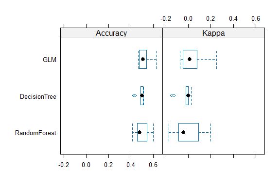<!-- -->

## Saving Model

``` r
# Save the Random Forest model to an RDS file
saveRDS(model_rf, "./models/saved_rf_model.rds")

# Load the saved Random Forest model
loaded_rf_model <- readRDS("./models/saved_rf_model.rds")

# Example new data for prediction
new_data <- data.frame(
  Player_Age = 24,
  Player_Weight = 66.25,
  Player_Height = 175.73,
  Previous_Injuries = factor(1, levels = c(0, 1)),
  Training_Intensity = 5,
  Recovery_Time = 0.46,
  Likelihood_of_Injury = factor(0, levels = c(0, 1))
)

# Use the loaded model to make predictions
predictions_loaded_model <- predict(loaded_rf_model, newdata = new_data)

# Print the predictions
print(predictions_loaded_model)
```

    ## [1] 1
    ## Levels: 0 1
